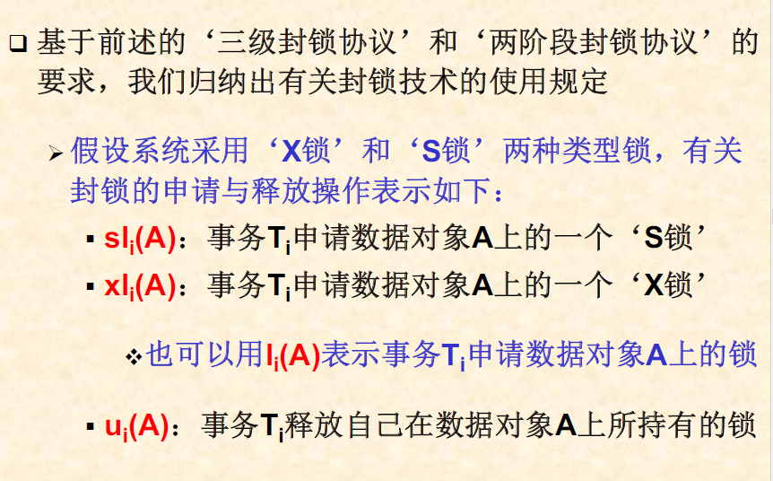

# 五、事务处理、并发控制与故障恢复技术

## 5.1事务处理

### 5.1.1事务
+ 事务
> 由某个用户所执行的一个不能被打断的对数据库的操作序列被称为"事务"  

  - 是应用程序访问数据库的**基本逻辑工作单位**
  - 执行过程按照预定的次序顺序执行
  - 执行过程的串行。在执行过程中，数据库中的数据可能有不一致的现象，在执行结束时，系统将保证数据库中数据的一致性。

### 5.1.2事务的性质
ACID特性：
+ 原子性
> 在一个事务中，所有的数据库访问操作构成一个不可分割的操作序列，这些操作要么全部执行结束，要么一个都不要执行。
+ 一致性
> 一个事务的成功执行总是将数据库从一个一致的状态转换到另一个一致的状态  

要求数据库中的数据满足:  
  - 在数据库中显式定义的各种完整性约束
  - 用户心目中的隐式数据约束

事务的一致性由两方面完成： 
  - DBMS中的**数据完整性保护子系统**
  - 编写事务的应用程序员

+ 隔离性
> 一个事务的执行与并发执行的其他事务之间是相互独立的，互不干扰。  

隔离性的要求：
> 多个事务并发执行的最终结果，应该与它们的某种串行执行的最终结果相等(并发事务的可串行化)  

事务执行的'隔离性'是由DBMS的**并发控制子系统**来实现。
> 当多个事务并发执行时，每个事务都可以看成只有自己在执行。只有当它与其他事务发生封锁冲突时，才会感觉到其他事务的存在。  

+ 持久性
> 一个事务一旦完成其全部操作后，它对数据库的所有更新应永久地反映在数据库中，即使以后系统发生故障也应该能够通过故障恢复来保留这个事务的执行结果  

是由DBMS的**恢复管理子系统**实现的。 

### 5.1.3事务活动

+ '活动'状态
> 事务在开始执行后，立即进入“活动”状态。在“活动”状态中，事务将执行对数据库的访问操作  
+ 读操作
  - 将数据读入用户事务的私有工作区间
  - 如果该数据当前不在DBMS的系统缓冲区中，那么DBMS首先将该数据从磁盘读入系统缓冲区，然后再将其拷贝到用户事务的私有工作区  
+ 写操作
  - 降修改后的数据写入数据库
  - 很可能暂时存放在DBMS的系统缓冲区中

+ 预提交状态  
> 当事务的最后一条访问语句执行结束之后，事务进入预提交状态。其对于数据的修改结果可能还在内存的系统缓冲区中，必须将其真正写入数据库的磁盘。  
  - 在所有写磁盘操作执行结束后，事务就进入提交状态  
  - 在预提交失败后，当前事务也将被放弃，事务转而进入失败状态。
  
+ 失败状态
> 处于活动状态的事务在顺利到达并执行完最后一条语句之前就中止执行，或者在预提交状态下因发生系统故障而中止执行。  
  - 事务从活动->失败的原因：
    * 应用程序(或用户)主动放弃当前事务
    * 因并发控制的原因而被放弃的事务(封锁申请的超时等待，死锁)
    * 发生系统故障
  - 事务从'预提交'状态转变为'失败'状态的原因
    * 发生系统故障

+ 异常中止状态
> 处于失败状态的事务，很可能已对磁盘中的数据进行了一部分修改。喂了保证事务的原子性，系统应该撤销该事务对数据库已作的修改。在撤销操作完成以后，事务将被打上一个放弃的标志，转而进入'异常中止'状态。  
  - 回退
    * 对事务的撤销操作也称为事务的回退或回滚
    * 事务的回退由DBMS的恢复子系统实现。
  - 在事务进入'异常中止'状态后，系统有两种选择
    * 作为一个新的事务，重新启动
    * 取消事务

+ 提交状态
  - 事务进入'预提交'状态，并发控制子系统将检查该事务与并发执行的其他事务之间是否发生干扰现象。
  - 在检查通过以后，系统执行提交操作，把对数据库的修改全部写在磁盘上，并通知系统，事务已成功地结束
  - 为事务打上一个提交标志，事务就进入'提交'状态。

**提交和异常中止都意味着一个事务的执行结束**

### 5.1.4有关事务的语句
事务除了一组对于数据库的访问操作构成以外，还包括少量的事务控制语句，用于定义一个事务的开始和结束。

#### 事务的开始
事务的启动是隐式的。可以通过三种方式来启动一个新的事务。 
+ 数据定义命令(DDL)
  - 每一条数据定义命令都将被作为一个单独的事务来执行
  - 在此之前的用户事务将被自动提交
+ 将系统设为自动提交方式(打开自动提交状态)
  - 每一条数据库访问命令都将被作为一个单独的事务来执行，并根据执行结果自动提交或回退
+ 数据操纵命令(DML)
  - 在当前用户的前一个事务执行结束之后，在用户提交的下一条数据库访问操作之前，数据库管理系统将自动启动一个新的事务
#### 事务的结束
+ 正常结束
  - 提交事务
    > 提交当前事务，事务在执行过程中对于数据库的所有修改操作都将被永久地反应到数据库中，并且不可被取消  
    
  可能失败： 
    * 发生系统故障
    * 在提交阶段执行的数据完整性检查  
    
  在事务提交失败后可以通过回退来取消当前事务。  
  由系统自动提交的事务，如果提交失败，系统将自动执行事务的回退操作。
+ 非正常结束
  - 回退事务
  > 取消在该事务执行过程中的所有操作，回滚该事务至事务的起点，以便重新执行或放弃事务。  

  检查点
    * 在事务的执行过程中，系统可以为该事务设置若干个检查点
    * 用户事务可以使用rollback命令将当前事务回退到前面的某个检查点sp，放弃“在检查点sp之后，回退操作之前”的所有访问操作，并继续执行当前事务。
    * 不带检查点的回退操作将结束并放弃整个事务

#### 与事务有关的控制命令(DCL)
+ 设置事务的自动提交命令
> SET AUTO COMMIT ON|OFF  
+ 设置事务的类型
> SET TRANSACTION READONLY|READWRITE  

定义在这之后启动的所有事务在执行过程中对数据库的访问方式。  
读写型事务是事务的缺省类型定义。
+ 设置事务的隔离级别
> SET TRANSACTION ISOLATION LEVEL READUNCOMMITTED|READCOMMITTED|READREPEATABLE|SERIALIZABLE

+ 三种数据不一致现象 
  - 丢失修改
    > 一个事务的修改结果破坏了另一个事务的修改结果
  - 脏读
    > 读到了错误的数据
  - 不可重复读
    > 在一个事务的执行过程中，前后两次读同一个数据对象所获得的值出现了不一致

  - 原因：  
    > 多个并发执行的事务反复交叉使用同一数据库(数据对象)，而数据库管理系统又没有提供必要的控制手段 

> SET TRANSACTION ISOLATION LEVEL READUNCOMMITTED | READCOMMITTED | READREPEATABLE | SERIALIZABLE 

### 5.1.5事务的组成
+ 数据对象
  - 数据对象的大小
    > 一个属性值，一个元组，一张表(元组的集合)或整个数据库  
  - 数据对象的地址空间 
    > 同一个数据对象在不同的地方可能具有不同的值
    * 保存这些数据对象的磁盘空间
    * 数据库管理系统所使用的内存缓冲区
    * 事务的局部地址空间(内存变量)

+ 操作
  - 事务控制
    * 事务的开始:START T0
    * 提交事务:COMMIT T0
    * 回退事务:ABORT T0
  - 数据访问
    * INPUT(A):将数据对象A的值从磁盘中读入内存缓冲区
    * OUTPUT(A):将内存缓冲区中数据对象A的值写入磁盘
    * READ(A,t):**一个READ操作可能隐含一个INPUT操作**
    * WRITE(A,t):将内存变量t的值写入内存缓冲区中数据对象A

---
## 5.2并发控制技术
### 5.2.1事务的并发执行
+ 并发性  
每个用户(或用户程序)都是以“事务”为单位访问数据库  
+ 多个事务的执行方式
  - 串行执行
    > 以事务为单位，多个事务依次顺序执行
  - 并发执行
    > 按一定调度策略交替执行
  - 并发执行的可串行化
    > 如果一组事务并发执行的结果等价于它们之间的某种串行执行的结果，则称为可串行化调度

+ 并发控制的目标:实现并发事务的可串行化调度  

+ 调度
> 一个或多个事务中的数据库访问操作，按照这些操作被执行的时间排序所形成的一个操作序列  

+ 数据库访问操作

+ 串行调度
> 首先是一个事务的所有操作，然后是另一个事务的所有操作。每一个事务中的所有操作，都是按照其预定的顺序依次执行。  

任何一个串行调度均具有以下性质
  - 任取两个事务X和Y，如果X的某个操作在Y的某个操作之前，则X的所有操作都在Y的所有操作之前。 

+ 可串行化调度  

+ 事务及调度的表示方法   
  - 在事务的执行过程中，只关系它对数据库中的哪些数据对象进行了读/写操作。  
  - 事务及调度的记法  
    * 事务用符号$T_{1},T_{2},..$表示  
    * 用$r_{i}(X)$表示事务$T_{i}$读数据库对象X  
    * 用$w_{i}(X)$表示事务$T_{i}$写数据库对象X  

+ 冲突可串行化
> 指调度中的一对连续操作(op1,op2)，如果交换它们两者的执行顺序，那么涉及的事务中至少有一个的行为会改变   
  - 冲突的判断 
    * 同一事务中的任意两个操作不可用交换它们的执行顺序  
    * 不同事务中的任何两个操作在执行顺序上是可以交换的，除非 (1)它们涉及同一个数据对象，并且(2)至少有一个是写操作  

 
如果通过一组"非冲突"操作的交换，能够将该调度转换为一个串行调度，则最初的调度就是一个可串行化调度。  

+ 冲突等价 

+ 冲突可串行化

冲突可串行化是可串行化的一个**充分条件**，非必要条件

+ 优先图  
  - 思想:冲突操作反映了给定事务在冲突等价的串行调度(如果存在的话)中的执行顺序  
  - 定义:调度S中存在两个事务T1,T2,如果T1的一个动作A1和T2的一个动作A2满足:
    * 在调度S中A1在A2前  
    * A1和A2涉及数据库中的同一数据对象，且至少有一个是'写'动作  
  T1优先于T2，T1 <s T2  

  

+ 冲突可串行化的判断规则  
如果该图是无环，则S是冲突可串行化。  
如果有环，不是冲突可串行化。 

### 5.2.2封锁
#### 封锁
+ 前提：在一个事务访问数据库中的数据时，必须先获得被访问的数据对象上的封锁
+ 作用
  - 在一段时间内禁止其他事务在被封锁的数据对象上执行某些类型的操作(由封锁的类型决定)
  - 持有该封锁的事务在被封锁的数据对象上将要执行什么类型的操作(由系统所采用的封锁协议来决定)

#### 封锁类型
+ 排他锁(X锁)
  - 特性
    * 只有当数据对象A没有被其他事务封锁时，事务T才能在数据对象A上施加X锁
    * 如果事务T对数据对象A施加了X锁，则其他任何事务都不能再数据对象A上再施加任何类型的封锁
  - 作用  
    事务T自身可以对数据对象A作读，写操作，而其他事务则被禁止访问数据对象A
  
  X锁必须维持到事务T的执行结束
+ 共享锁(S锁)
  - 特性：  
  如果数据对象A没有被其他事务封锁，或者其他事务仅仅以S锁的方式来封锁数据对象A，事务T才能在数据对象A上施加S锁。
  - 作用：  
    * 事务T可以读数据对象A，但不能写数据对象A
    * 在持有封锁的事务释放数据对象A上的所有S锁之前，任何事务都不能写数据对象A

  S锁不必维持到事务T的执行结束(依封锁协议而定)

+ 锁相容矩阵

+ 合适事务
> 如果一个事务在访问数据库中的数据对象A之前按照要求申请对A的封锁，在操作结束后释放A上的封锁。  
  - 是保证并发事务的正确执行的基本条件  

+ 封锁的申请与释放
  - 封锁管理器的数据结构
    * 数据LOCK(A)
      > 记录被施加在数据对象A上的封锁类型:Read_locked,Write_locked,Unlocked
    * 数组no_of_reads(A)
      > 记录被施加在数据对象A上的共享锁的个数

#### 使用封锁的并发控制技术
+ 封锁管理器中维护着一张锁表
  - 封锁的持有情况
  - 封锁的申请情况
+ DBMS对于用户事务的数据访问操作(Op(A))的处理过程  

### 5.2.3封锁协议
#### 封锁协议
三级封锁协议:不同级别的封锁协议可以防止不同的并发错误  
两阶段封锁协议  
+ 一级封锁协议(写)  
  - 事务T在写数据对象A之前，必须先申请并获得A上的X锁，并维持到事务T的执行结束才释放被加载A上的X锁  
  - 可防止丢失修改现象
+ 二级封锁协议(读)  
  - 一级封锁协议+事务T在读A之前，必须先申请并获得A上的的S锁，在读操作完成后即可释放A上的S锁
  - 可防止丢失修改，脏读现象
+ 三级封锁协议  
  - 一级封锁协议+在读数据对象A之前，必须先申请并获得A上的S锁，并维持到事务T的执行结束
  - 可防止丢失修改，脏读，不可重复读现象

三级封锁协议与三种数据不一致现象的关系  

+ 多个事务的并发运行破坏数据库状态的一致性(原因)
  - 事务没有为被访问的数据对象申请封锁
  - 事务没有在合适的时候释放所持有的锁
### 5.2.4两阶段封锁协议(2PL协议)
在一个事务执行过程中，必须把锁的申请与释放分为两个阶段:  
+ 申请并获得封锁(扩展阶段)
+ 释放所有申请获得的锁(收缩阶段)
  - 事务一旦开始释放封锁，那么就不能再申请任何封锁  

> 如果所有的封锁请求都先于所有的解锁请求，则该事务被称为两阶段封锁事务。  

### 5.2.5封锁粒度
#### 封锁粒度
> 一把锁可以封锁的数据对象的大小  
可以是数据库中的逻辑数据单元，也可以是物理数据单元  
+ 逻辑数据单元
+ 物理数据单元  

#### 多粒度封锁
> 在一个系统中同时支持多种封锁粒度供事务选择使用  

+ 通过加大封锁粒度来减少锁的数量，降低并发控制的开销 
+ 通过降低封锁粒度来缩小一把锁可以封锁的数据范围，减少封锁冲突现象，提高系统并发度  

+ 多粒度树

+ 多粒度封锁协议
  - 可以对多粒度树中的每个结点独立加锁(显式封锁)
  - 对一个结点加锁意味着该结点的所有后裔结点也被加以同样类型的锁(隐式封锁)  
  - 两种方式作用一样 
  - 对多粒度树种的某个结点加锁，需要在该结点的所有先驱结点和后裔结点中都进行锁的相容性检查。  
#### 意向锁
+ 使用规定
  - 对一个结点加意向锁，则说明该结点的下层结点正在被加锁
  - 对任一结点加锁时，必须先对它的上层结点加意向锁  
+ 三种意向锁
  - 意向共享锁(IS锁)
    > 对结点N加上IS锁，表示准备在结点N的某些后裔结点上加S锁
  - 意向排它锁(IX锁)
    > 对结点N加上IX锁，表示准备在结点N的某些后裔结点上加X锁
  - 共享意向排它锁(SIX锁)
    > 在结点N加SIX锁，表示对结点N本身加S锁，并准备在N的某些后裔结点上加X锁  

+ 带有意向锁的锁相容矩阵

### 5.2.6活锁与死锁
