# 数据库的安全性与完整性保护

## 4.1数据库的安全性
### 4.1.1数据库的安全与安全数据库
#### 数据库的安全
要求数据库的用户
+ 通过规定的访问途径
+ 按照规定的访问规则  

适应网络环境下安全要求级别的数据库称为**安全数据库**

### 4.1.2数据库安全的基本概念与内容
#### 可信计算基TCB
> 是为实现数据库安全所采用的所有实施策略与机制的集合，是实施、检查、监督数据库安全的机构  
#### 主体、客体与主客体分离
> 客体：数据库中的数据及其载体 主体:数据库中数据的访问者
#### 身份标识与鉴别
三种控制方式
+ 身份标识与鉴别(最外层安全保护措施)
> 每个主体必须有一个标志自己身份的标识符以及一个用以验证其身份的访问口令
  - 登录控制
  - 口令字选取
  - 对鉴别数据的保护
  - 会话连接挂起
  - 用户账号和属性文件
+ 自主访问控制(DAC)

- 基于存取矩阵的自主访问控制功能
  * 安全政策范围验证
  * 控制主体访问客体的规则验证
  * 超越DAC的特权验证
- 对DAC属性的控制
  * 改变客体的许可权限
  * 对新建客体的缺省保护
  * 改变客体的属主
  * 改变用户组的隶属关系
- DAC的特点
  * 存取矩阵中的元素是可以随意改变的
  * 主体可以通过授权/回收操作变更某些操作权限
  * 适合于单机方式下的访问控制

+ 强制访问控制(MAC)
> 主体访问客体的一种强制性的安全控制方式，主要用于网络环境，对网络中的数据库安全实体作统一的、强制性的访问管理。
  - 主/客体标记
    * 安全级别标记：规定了主/客体的安全级别
    * 安全范围标记：规定了主体可以访问的范围(客体所处的范围)
  - 必须满足系统所采用的强制访问控制策略的要求。
  - 实施机制：Bell-Lapadula模型
  - 强制性的访问控制措施
    * 安全政策范围验证(主体，客体以及操作)
    * 验证控制访问和信息流动的规则
    * 验证可超越MAC特权
  - 对MAC属性的控制
    * 改变客体标记
    * 对新建客体的缺省标记
    * 改变主体安全属性

#### 数据完整性
> 防止非法使用插入，删除，修改等影响数据完整性的操作
+ 控制手段
    - 对存储数据错误的检测
    - 事务回卷功能
+ 常用的控制手段:三类数据完整性  
    - 实体完整性
    - 关联完整性
    - 用户定义完整性约束

#### 隐蔽通道
> 在主体对客体的访问过程中，可通过自主及强制访问控制措施来提供安全保护
+ 公开通道
    > 正规的、接受TCB的(自主/强制)访问控制检查的访问通道
+ 隐蔽通道
    > 非正规的、不受TCB控制的访问通道

#### 数据库安全的形式化模型
> 用数学形式对数据安全模型的安全策略作形式化描述、验证与证明，形成严格的形式化体系。

#### 审计
+ 跟踪记录用户对数据的访问操作
   - 访问时间/访问内容/用户名/终端名/操作类型/操作结果
   - 并可根据审计结果给出报警信息
+ 与审计有关的保护措施：
  - 审计事件控制
    * 对可审计事件和需记录信息的说明
    * 对需审计事件选择的控制
    * 对单个身份审计
  - 入侵检测和应对
    * 生成报警信息，并对即将发生的安全违规行为采取应对措施  
    * 定义用于指示潜在或即将发生的安全违规行为的那些规则、事件、事件序列或系统使用模式 
  - 审计记录的保护
    * 避免数据丢失(审计记录饱和，操作中断)
    * 避免未授权的修改、访问
  - 审计记录的分析、查阅
    * 提供相应的分析、查阅工具

#### 访问监控器
> 是一个独立的(既非主体，亦非客体)、最小的、抗篡改的、自主机构，用来监控主体和客体之间的授权访问关系  
> TCB是一个抽象的功能、策略集合，访问监控器是一个客观存在的实体，是**TCB在网络中的实现**

### 数据库的安全标准
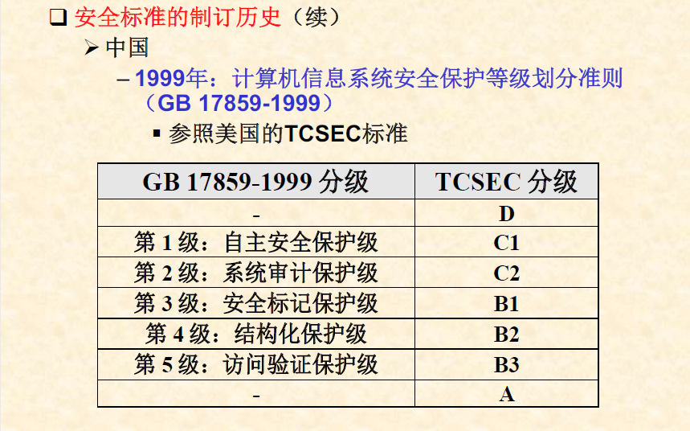  
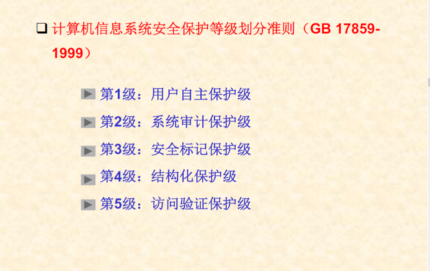
### SQL对数据库安全的支持
在SQL'92中提供了C1级数据库安全的支持：
+ 主体、客体以及主、客体分离
+ 身份标识与鉴别
+ 数据完整性
+ 自主访问控制与授权功能
> SQL中的自主访问控制是通过*用户，操作对象，操作权限*这样的三元组来定义用户对于数据的访问权限，并通过**授权**和**回收**语句来改变用户的访问权限。   

  - 操作权限
    * SELECT权
    * REFERENCE权
    * INSERT权
    * EXECUTE权
    * DELETE权
    * USAGE权
    * UPDATE权
  - 操作对象
    * 表，视图
    * 属性
    * 域(type),UDT(用户定义数据类型)
    * 存储过程/函数，触发器
  - 用户
    * 数据库用户

  - 授权语句
    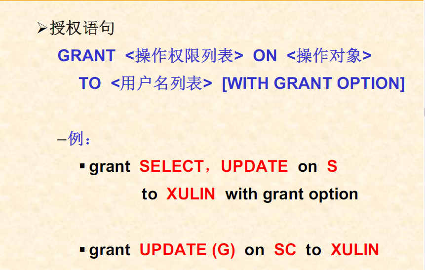  

  - 回收语句  
    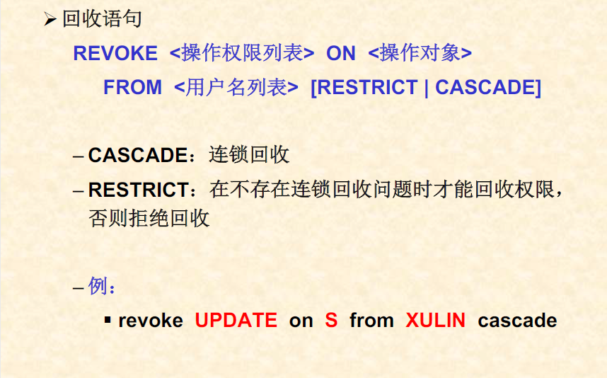

#### 自主访问控制与授权功能
+ 授权语句
> GRANT <操作权限列表> ON <操作对象> TO <用户名列表> [WITH GRANT OPTION]

+ 回收语句
> REVOKE <操作权限列表> ON <操作对象> FROM <用户名列表> [RESTRICT | CASCADE]  
> CASCADE:连锁回收  
> RESTRICT:在不存在连锁回收问题时才能回收权限，否则拒绝回收

## 数据库的完整性
### 数据库的完整性  
> 指数据库中数据的正确性和一致性  
> + 正确性：数据的有效性、有意义
> + 一致性：在多用户(多程序)并发访问数据库的情况下，保证对数据的更新不会出现与实际不一致的情况

### 完整性保护
对数据库中数据的正确性和一致性的维护，包括:
+ 在执行更新操作时，检查是否违反完整性约束条件，并且在证明其无效后作出适当的反应 
+ 防止有存取权的合法用户的误操作  
### 完整性保护的目的
+ 及时发现错误
+ 能够采取措施防止错误的进一步蔓延
+ 最终将数据库恢复到正确状态

### 完整性保护的实现措施
+ 完整性约束条件的定义及检查
+ 触发器
+ 并发控制技术

### 4.2.1数据库完整性保护的功能
三个基本功能  
+ 设置功能
> 系统及用户对数据库完整性的基本要求
+ 检查功能
> 有能力检查数据库中的数据是否有违反约束条件的现象出现
+ 处理功能
> 出现违反约束条件时，有及时处理的能力

### 4.2.2完整性规则的三个内容
+ 实体完整性规则
> 在一个基表的主关键字(主码)中，其属性的取值不能为空值  
+ 参照完整性规则(引用是否存在)
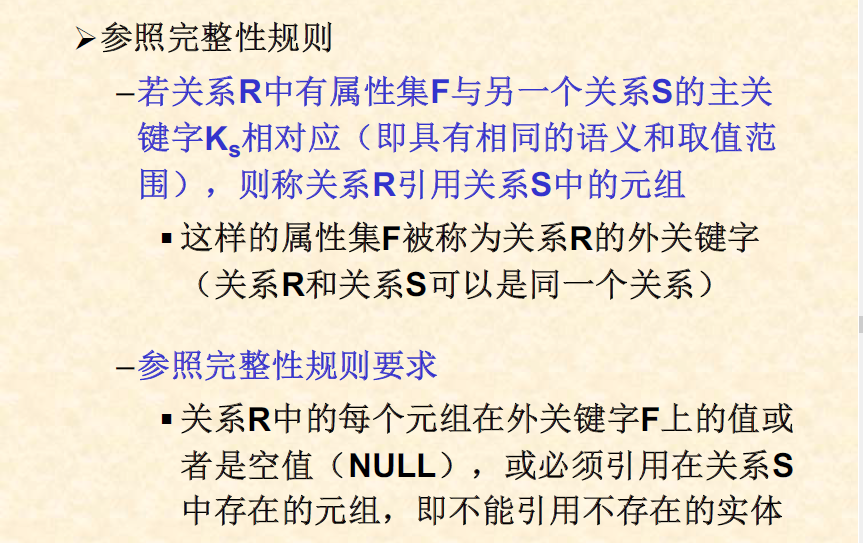
+ 用户定义的完整性规则
> 由用户来定义的数据完整性要求

### 4.2.3完整性约束的设置、检查与处理
一条完整性约束规则一般有三个组成部分 
+ 完整性约束条件的设置
  > CONSTRAINT <约束名> <完整性约束条件子句>
  - 属性级的约束(域约束)
    * 数据类型的约束，非空值约束，取值范围的约束
    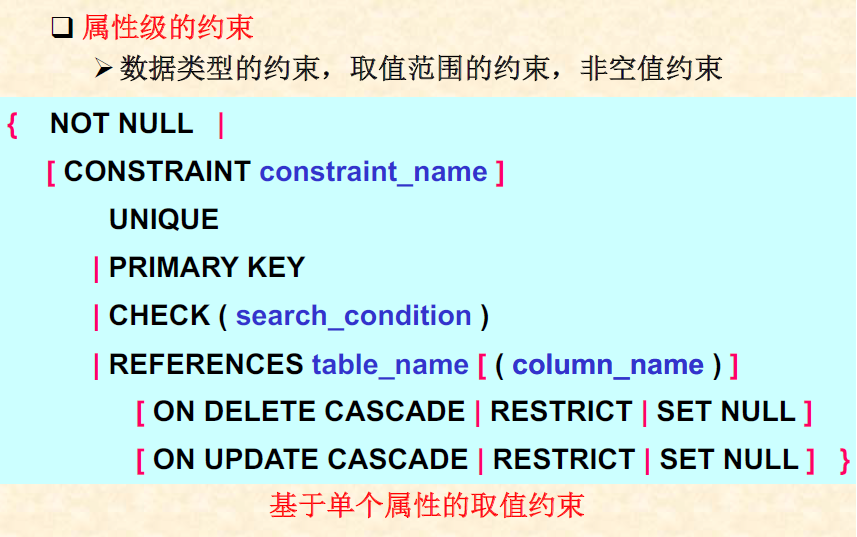  
    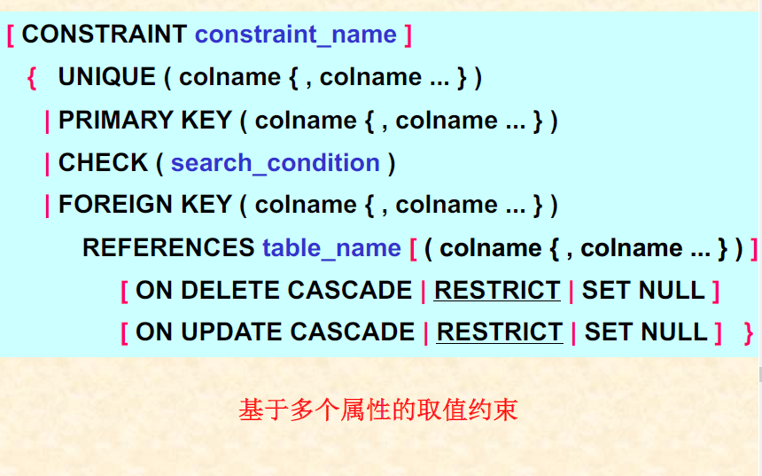
    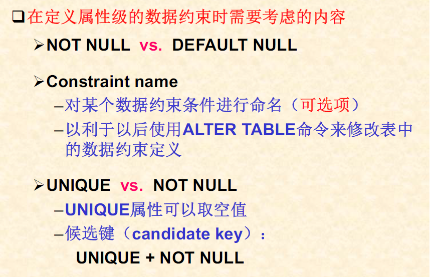
    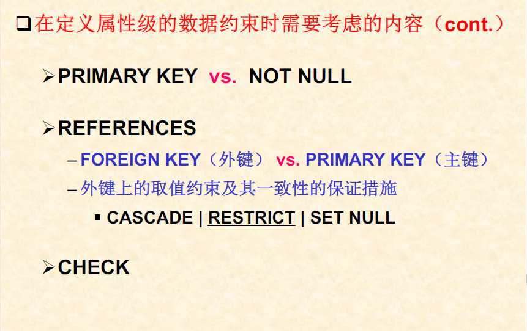
  - 元组级的约束(表约束)
    * 主码定义，候选码(唯一键)定义
    * 外码定义
    * 基于元组的检查子句:属性间关系的定义
    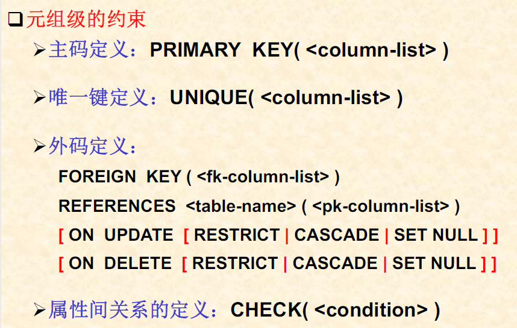 

  - 全局约束(断言assertion)
    * 单个关系中涉及到统计操作的约束条件
    * 多个关系之间复杂的约束条件
    * 定义断言
    > CREATE ASSERTION <name> CHECK (<condition>)  
    * 撤销断言
    > DROP ASSERTION <assertion-name-list>
  - 对约束命名
    > CONSTRAINT <约束名><完整性约束定义子句>
  - 创建基表命令(CREATE TABLE)
    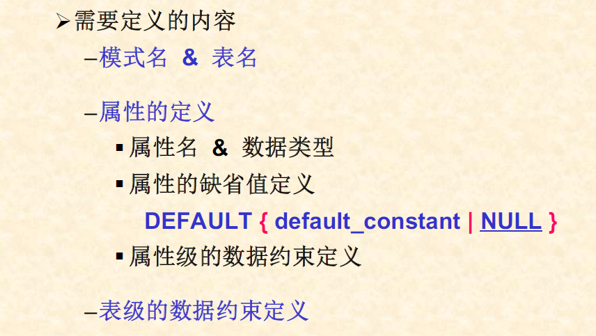
+ 完整性约束条件的检查  
> 在DBMS内部设置专门的软件检查模块
+ 完整性约束条件的处理  
在用户的操作会破坏数据的完整性(即违反完整性约束条件的要求)时，系统将  
  - 拒绝执行，并报警或报错
  - 调用相应的函数(例程)进行处理  
    * 在外键定义子句中给出的处理方法
    * 在触发器中给出的处理过程  
### 4.2.4触发器
+ 在数据库系统中，一个事件的发生会导致另外一些事件的发生，这样的功能被称为触发器 
+ 功能：某个事件的发生会导致另外一起事件的执行，以消除前一个事件对数据完整性所起的影响  
    - 数据的安全性保护
    - 用户的应用逻辑处理
    - 数据库系统的主动功能
#### 触发器的组成
+ 触发事件(用户定义)
> 通常为某个完整性约束条件的否定或某种数据操纵事件
+ 结果事件(用户定义)
> 当触发事件发生时，用以消除触发事件所引起的负面影响的程序
+ 触发过程
>  当DBMS检测到触发事件的发生时，自动调用并执行结果事件的过程

#### 触发器的定义命令
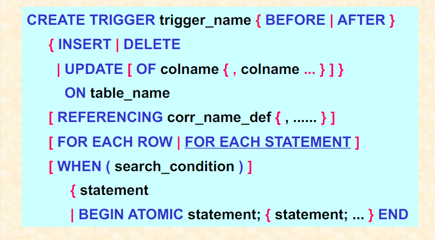   
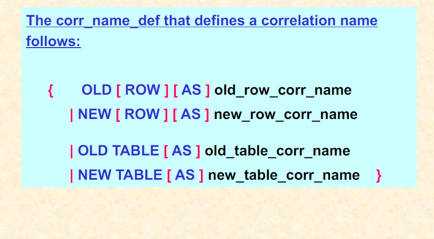

#### 触发器的删除命令
> DROP TRIGGER trigger_name  
