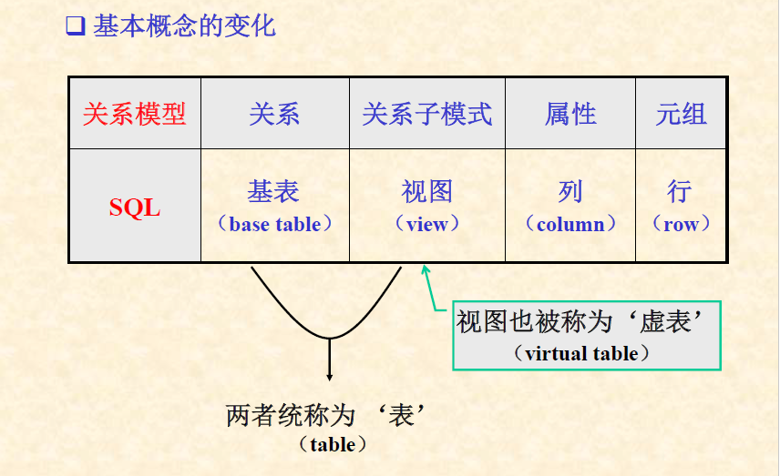
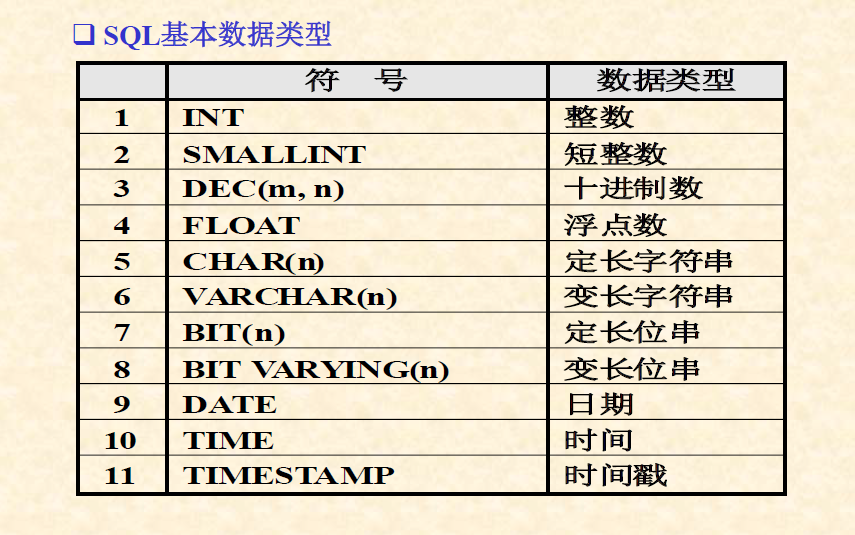
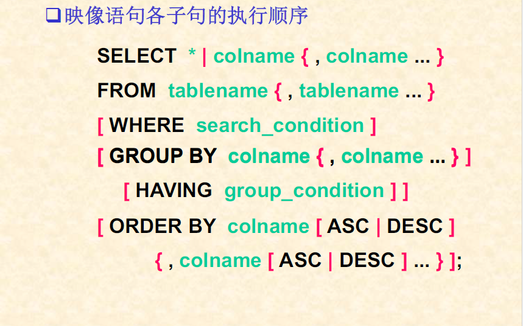
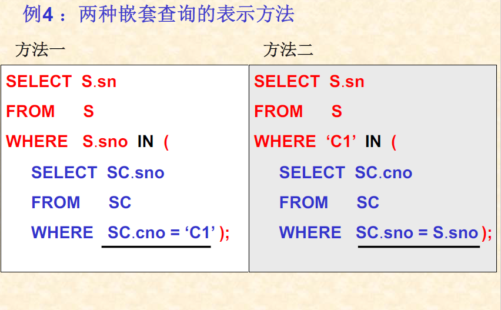
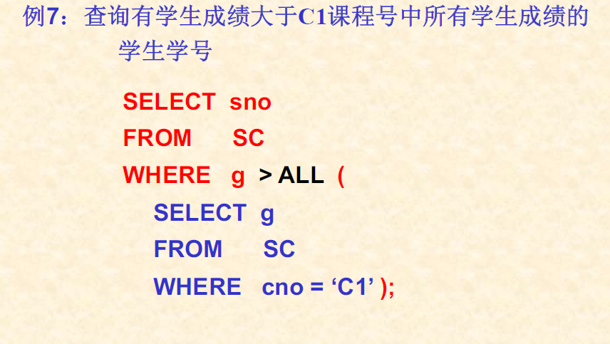
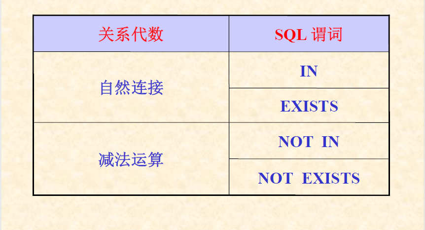
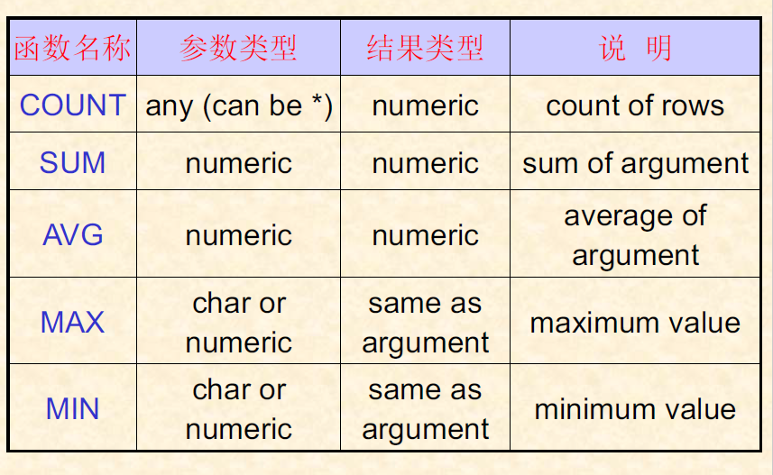
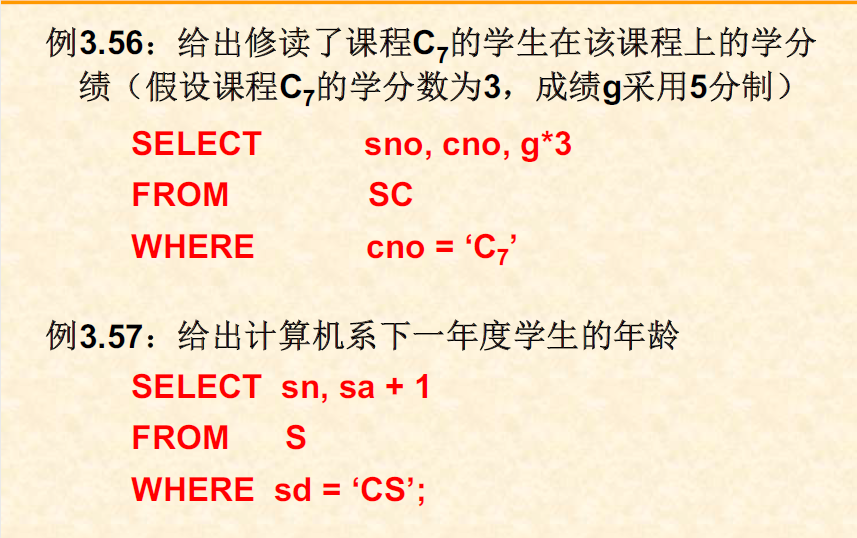
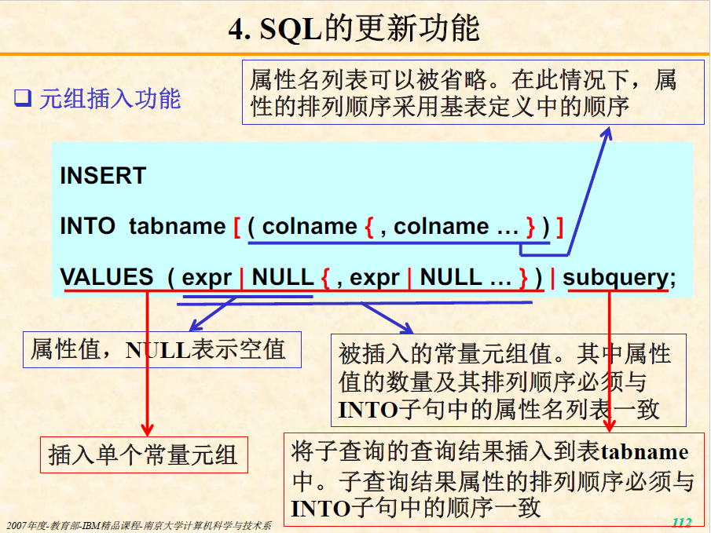
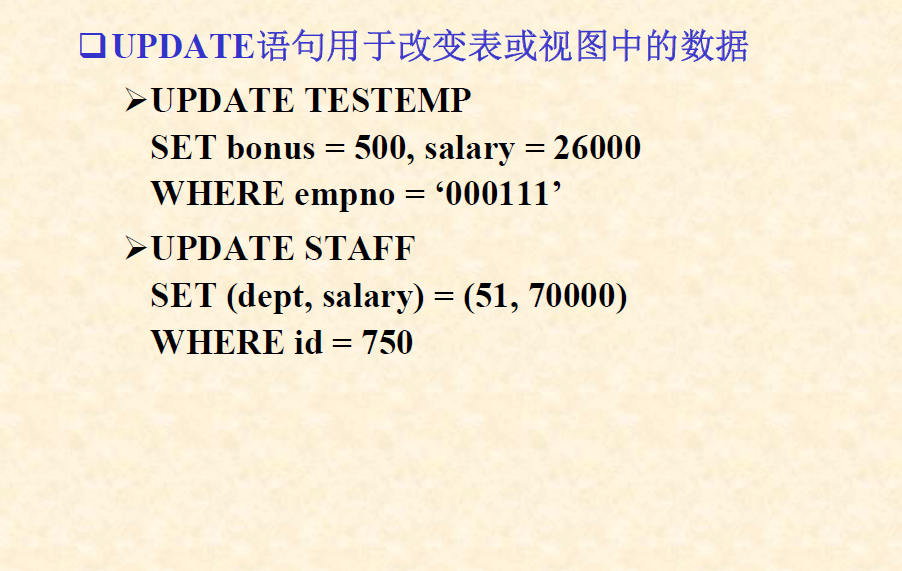

# 关系数据库系统

## 关系数据库系统概述
关系数据库系统的优点
+ 数据结构简单
+ 使用方便
  + 不涉及系统的内部物理结构
  + 非过程性数据子语言
+ 功能强
  + 模型表达能力强，具有一定的模型修改功能
  + 可方便的修改数据间的联系
  + 可灵活选择数据存取路径
  + 高级的数据操纵语言
+ 数据独立性高
  + 数据的逻辑结构不涉及物理因素
  + 操作的非过程性
+ 理论基础深 
+ 可移植性好
+ 标准化程度高
+ 分布式功能
+ 开放性
+ 其他方面的功能扩展

## 关系数据库系统衡量准则
+ 初期的'六条准则'
    + 提供高度的数据独立性
    + 提供严格的数据视图
    + 减轻DBA的工作
    + 建立理论基础
    + 事物管理与文件管理的结合
    + 操作对象是记录集合
+ 完全关系型的12条严格标准
    + 信息准则：所有信息用表中的元组或元组中的属性值来表示
    + 确保访问准则：应能保证用逻辑方式依靠表名，关键字值与列名的组合来访问每一个原子数据
    + 空值的关系处理准则
      + 空值：无意义或当前未知的值
      + 系统应该具有处理空值的能力
          + 空值的比较运算
          + 含有空值运算对象的表达式计算
          + 含有空值成员的集合上的统计运算
    + 基于资源管理的动态联机目录
    + 统一易用的数据子语言
      + 数据定义
      + 视图定义
      + 数据操纵
      + 完整性约束能力
      + 授权机制
      + 事物处理能力
    + 视图更新准则
    + 高级的插入、删除及修改操作
    + 物理数据独立性
    + 逻辑数据独立性
    + 数据完整性准则
    + 分布独立性
    + 无损害原则

+ 关系数据库产品的分类
  + 半关系型系统：满足12条准则中的少量要求
  + 基本关系型系统：满足12条准则中的大部分要求
  + 完全关系型系统：严格符合上述的12条准则

## 关系模型数学理论-关系代数
### 关系模型
+ 关系数据结构
  + 表结构
    - 表框架：n个属性构成(n元表)，每个属性有一个取值范围(值域)
    - 元组
  + 键(最小的superkey)
    - 主键
      * 唯一最小标识元组的属性集
      * 每张二维表至少存在一个'键'
    - 外键
      - 外键直接引用其自身表中的元组(取空或者取已存在的元组)
  + 关系
    - 二维表的性质(满足7个性质的二维表叫关系)
        > 元组个数有限性  
        > 元组的唯一性  
        > 元组的次序无关性  
        > 元组分量的原子性  
        > 属性名唯一性  
        > 属性的次序无关性  
        > 分量值域同一性  
  + 关系规则：
    - 第一范式：不能包含多值的域
    - 仅按内容访问行
    - 唯一行

名词术语之间的对应关系

+ 关系操纵  
建立在关系上的数据操纵功能  
  - 查询
    > 可分解为：  
    > 两个关系的合并  
    > 单个关系内的元组选择  
    > 单个关系内的属性指定  
    * 单张表内的数据查询
    > 纵向定位(选择满足某些逻辑条件的元组)，横向定位(指定关系中的一些属性)
    * 两张表之间的数据查询
    > 先将两张表合并为一张表  
    > 再了利用单张表内的数据查询操作进行查询
    * 多张表上的数据查询
    > 先将多张表合并为一张表  
    > 再利用单张表内的数据查询操作进行查询 
  - 增加
    * 一条操作只能向一个关系中增加新的元组
  - 删除(基本单位是元组)
    * 确定被删除的元组：只能删除一个关系内的元组，利用单个关系内的元组选择操作来确定 
    * 执行删除操作 
  - 修改
    * 在一个关系内修改指定元组的某些列上的值 
    * 由其他数据操纵方式来实现
      > 先删除需要修改的元组  
      > 然后插入修改后的新元组  

  - 空值处理  
    - 关系的主键中不允许出现空值
    - 有关空值的运算
      * 在算数表达式中如出现空值，运算结果也为空值
      * 在逻辑运算表达式中如出现空值，其运算结果为逻辑假
      * 统计计算中，对于'空集'和集合中的'空值'的处理方法  
        > SUM,AVG,MAX,MIN,COUNT,集合中的空值不统计在内  
        > 对空集作SUM,AVG,MAX,MIN，其统计结果均为空值  
        > 对空集作COUNT，统计结果为0  
      
  - 三类数据完整性约束
    * 实体完整性约束:主键中的属性不能为空值
    * 参照完整性约束:外键要么取空值，要么是被引用表中当前存在的某元组上的主键值  
    * 用户定义的完整性：用户自己定义的属性取值约束

### 关系表示
关系是元组的集合，元组是元组分量的集合。  
n元关系(属性)  
一个n元关系就是一个n元有序组的集合  
+ 笛卡尔乘积  
 - 存在n个集合$D_{1},D_{2}...D_{n}$,它们的笛卡尔乘积是$D_{1}*D_{2}*D_{3}*...*D_{n}$(也是一个集合) 
 - 设集合$D_{i}$的元素个数为$r_{i}$，则它们的笛卡尔乘积的结果元素个数为:
$$ r_{1}*r_{2}*...*r_{n}$$
+ 关系R 
n元关系R是一个n元有序组的集合。  
n元关系R的属性域分别是$D_{1},D_{2}...D_{n}$，n个域的笛卡尔乘积也是一个n元有序组的集合
并且与n元关系R存在如下联系：  
$R \subseteq D_{1}*D_{2}*...*D_{n}$

### 关系操纵的表示
四种类型的数据操纵功能可以被分解为关系模型上的五种基本操作    

+ 运算的执行条件
  - 相容表：有相同的表头(**属性都取自相同的值域，并且有相同的含义(列的名字相同，与顺序无关)**)
  - 并，交，差：前提是相容表  
  - 并，交有交换律与结合律，差运算没有。
    * $R \cap S = R - (R - S) = S - (S - R)$
    * $(R - S) \cap S = \emptyset$
    * $(R - S) \cap R = R - S$
    * $(R - S) \cap (S - R) = \emptyset$

+ 运算的执行结果
  - 结果关系的关系模式
  - 结果关系中的元组

+ 并运算：
    > 参与运算的两个关系必须是同类关系(具有相同的属性个数，对应的列所表示的属性具有相同的值域),结果：关系模式不变
+ 差运算：
  > 参与运算的两个关系必须是同类关系。结果：关系模式不变   

### 关系模型与关系代数
+ 投影运算：略去关系中的某些列并重新安排剩余列的排列次序的运算
  - 设关系R有n个属性A1,A2,A3...AN，在其中m个属性B1,B2,..BM上的投影运算可以表示为：
  $$ \Pi_{B_{1}B_{2},...,B_{m}}(R) $$  
  其中：$R_{i} \in {A_{1},A_{2},..,A_{n}}(i=1,2,..,m)$
  - 运算结果是一个由$B_{1},B_{2},...,B_{m}$所组成的**m元关系**
  - 关系R中的每个元组t在这m个属性上的取值也构成结果关系中的一个元组  
  - 必须消除结果关系中可能出现的重复元组
  - 不满足交换律

+ 选择运算:$\sigma_{F}(R)$  
  - 根据给定的条件F从关系R中选出符合条件的元组
  - 结果：结果关系的关系模式不变，由属于关系R且满足条件F的**元组**所组成
  - 条件F的构造
    * 基本逻辑条件:$\alpha \theta \beta$  
    * 复合逻辑条件:$\land  \lor$
  - 取值要加引号
    
  - 满足交换律：查询优化

+ 可以结合使用投影和选择运算来实现单张表中的数据查询操作:$\Pi_{A}(\sigma_{F}(R))$**(先行后列)**
  - 先根据条件F对关系R进行选择运算
  - 再对选择运算的结果关系进行投影运算
  - 可以简写为:$\Pi_{A}\sigma_{F}(R)$，没有括号运算顺序为*从右向左*  ，两个运算的书写次序不能颠倒 

+ 关系的笛卡尔乘积：$R*S$  
  - 两个关系的合并运算  
  - R和S分别有n和m个属性，则笛卡尔乘积有n+m个属性
  - R和S分别有p和q个元组，则笛卡尔乘积就含有p*q个元组
  
  
不会出现同样名字的列
  - 满足交换律和结合律
  - R和S存在先沟通的属性名，必须在结果关系中对其中的一个进行换名  

+ 关系数据库中的四种类型的操作，均可以用关系代数表达式来表示  
  - 元组插入
    > 设新增加的元组构成关系R',则插入操作:$R\cup R'$
  - 元组删除
    > 设欲删除的元组构成关系R'，则删除操作可表示为：$R-R'$
  - 修改操作
    > 欲修改的元组构成关系R'，修改后生成的新远古构成关系R''，则修改操作可表示为:$(R-R')\cup R''$
  - 查询操作
    * 单个操作:选择+投影
    * 多个关系：先用笛卡尔乘积将多个关系合并为一个关系，然后再执行单个关系上的数据查询操作  

例：求最大折扣

### 关系代数中的扩充运算
+ 交运算
  - 条件：同类关系
  - 结果：关系模式不变
+ 除运算:$R \div S$
  - 运算条件：$Head(S) \subset Head(R)$
    $Head(R) = {A_{1},A_{2},...,A_{n},B_{1},B_{2},...,B_{m}}$  
    $Head(S)={B_{1},B_{2},...,B_{m}}$  
    其中：S被称为"除数关系",R被称为"被除数关系",结果关系被称为"商"
  - 结果关系($T=R \div S$)
    * 关系模式：$Head(T)=Head(R)-Head(S)={A_{1},A_{2},...,A_{n}}$
    * 结果元素：S中所有元组在R中所对应的同一个值
  - 与笛卡尔乘积的关系
    * 如果$R=T * S$,$T=R\div S$,$S=R \div T$  
    * 如果$T=R\div S$, $T * S \subseteq R$ 
  - 与基本关系运算的关系 
    > IF $Head(R)={A_{1},..,A_{n},B_{1},...,B_{n}}$ $Head(S)={B_{1},..,B_{m}}$  
    > $R \div S = \Pi_{A_{1},..,A_{n}}(R)-\Pi_{A_{1},...,A_{n}}((\Pi_{A_{1},..,A_{n}}(R)*S)-R)$
+ 联接运算($\theta$-联接运算，可以将关系R和关系S根据联接条件F合并为一个关系)
  - 设结果关系为T，$Head(T) = Head(R) \$,**不必消除它们之间的同名属性**  
  - 构造方式:$R \Join_{F} S$
    * 基本条件:$i \theta j$  
      > i是关系R中的属性，j是关系S中的属性，$\theta$是比较运算符(大于联接，小于联接，等值联接)  
    * 有若干个基本条件经$\land$$\lor$连接而成的复杂条件
  - 推导公式:$R\Join_{F} S = \sigma_{F}(R*S)$ 
  - 联接运算与笛卡尔乘积运算的关系
    > 设$T_{1}=R*S, T_{2}=R\Join_{F}S$,则$Head(T_{2})=Head(T_{1})，且T_{2}\subseteq T_{1}$ 
+ 自然联接运算：$R\bowtie S$
  - 功能：根据两个关系中的同名属性(公共属性)进行等值联接。
  - 运算条件：
    * 关系R和关系S有公共属性：$Head(R) \cap Head(S) \neq \emptyset$
  - 运算结果:结果关系的属性集合为$Head(R)\cup Head(S)$
  - 结果关系中的元组:同名属性上的取值在结果关系中只保留一份
  - 推导公式:
    > 设$R={A_{1},A_{2},...,A_{n}},S={B_{1},B_{2},..,B_{n}}$,它们之间的公共属性为$A_{1},..,A_{j}$与$B_{1},B_{2},..,B_{j}$  
    > $B\bowtie S=\Pi_{A_{1},A_{2},..,A_{n},B_{j+1},..,B_{m}}(\sigma_{A_{1}=B_{1}\land A_{2}=B_{2}\land ...\land A_{j}=B_{j}}(R*S))$  

+ 其他联接运算  
  - 外联接:$R⟗S$
  - 左外联接:$R⟖S$
  - 右外联接:$R⟕S$
### 关系代数实例
求解过程:
+ 确定查询目标
+ 确定查询条件
+ 选择从条件到目标的查找路径，并据此确定操作对象
+ 关系的合并
+ 元组的选择
+ 属性的指定

## 关系数据库语言SQL'92
### SQL概貌
+ 基本概念的变化
 

+ SQL语言的两种使用方式
  - 自含式:独立的交互式命令行语言
  - 嵌入式:嵌入到某种高级程序设计语言(主语言)中使用
    * 嵌入方式:嵌入式SQL(ESQL)，函数调用

+ SQL的功能
  - 数据定义功能
    * 基表/视图的定义与删除
    * 索引/集簇的定义与删除
  - 数据操纵功能
    * 数据的查询/插入/删除/修改
    * 简单的数值计算与统计功能
  - 数据控制功能
    * 数据的完整性，安全性，并发控制，故障恢复
  - 数据交换功能
    * 会话，连接，游标，诊断，动态SQL
  - 扩展功能

+ SQL的特点
  - 综合统一
  - 高度非过程化
  - 面向集合的操作方式
  - 以同一种语法结构提供多种使用方式
  - 语言简洁，易学易用
  
### SQL数据定义功能
+ SQL数据类型

+ 基表的创建
  > CREATE TABLE tablename (  
    colname datatype [NOT NULL]  
    {, colname datatype [NOT NULL]}  
    );
+ 基表的修改
  - 对基表结构的修改
    > ALTER TABLE <基表名> ADD <列名> <数据类型>  
    > ALTER TABLE <基表名> DROP <列名>
  - 数据完整性约束的修改
+ 基表的删除
  - 删除指定的表及其数据
    > DROP TABLE <基表名>

### SQL数据操纵功能
+ 数据查询 
+ 插入，删除，修改
+ 作为自含式语言还具有以下功能：
  - 赋值功能
  - 计算功能
    * 简单的四则运算
    * 统计计算
    * 分组统计
  - 输入/出功能

+ SQL的基本查询功能
  - 关系代数：$\Pi_{A_{1},A_{2}..,A_{n}}$
  - SQL语言
    > SELECT $A_{1},A_{2},..,A_{n}$  
    > FROM $R_{1},R_{2},..,R_{n}$  
    > WHERE F

  - 映像语句(必不可少:SELECT, FROM)
    > 目标子句:***SELECT \*|colname {,colname ...}***
      * 定义结果关系所需要的属性
      * 构造方式:
        - 给出结果属性的属性名:表名.属性名；
        - 结果属性的重命名(column_expression AS colname)
        - 可使用保留字'distinct'来消除结果关系中的重复元组  
    > 范围子句:***FROM***
      * 指定操作对象
      * 定义一个别名:<table_name> <alias_name>(主要用于关系自身的联接运算)
    > 条件子句:***WHERE search_condition***
      * 定义查询条件
      * 单个关系中的元组选择条件，关系与关系之间的联接条件
    > 分组子句:***GROUP BY***  
      * 默认升序  
      * 
    > 分组查询子句:***HAVING***  
    > 排序输出子句:***ORDER BY***  
    * 各子句的执行顺序:FROM, WHERE, GROUP BY, HAVING, SELECT, ORDER BY
    

  - 常用谓词
    * DISTINCT(仅用于SELECT)
    * BETWEEN... AND...
    * NOT BETWEEN ... AND...
    * LIKE   
      > column [NOT]LIKE val1 [ESCAPE val2]  
      > 模板:val1;'_':可以匹配任一字符；'%'可以匹配任一一个字符串(包括长度为0)  
      > 转义指示字符:val2 
    * NOT LIKE
    * IS NULL
    * IS NOT NULL

  - 布尔表达式
   > 在WHERE子句中，可以使用*NOT,AND,OR*
  
  - 简单连接
   > 在WHERE子句中，通过两个属性之间的相等比较实现表与表之间的连接

   - 自连接
    > 对相同的表进行连接，必须在FROM子句中至少对其中之一进行换名

  - 结果排序：***ORDER BY <列名> [ASC|DESC]{}***
    * 缺省升序

+ 分层结构查询与集合谓词使用
> 在一条映像语句的某个子句中嵌入另一条映像语句，被嵌入的通常称为'子查询'  
> 也称为'嵌套查询'  
> 子查询的查询结果是一个集合，需要在WHERE子句中引入集合谓词  
  - 集合谓词  
    * IN谓词：标量与集合量之间的属于比较
     > expr [NOT] IN (subquery)
    * 限定比较谓词：标量与集合中元素之间的量化比较
     > expr $\theta$ ANY|ALL (subquery)
    * EXISTS谓词：是否为空集的判断谓词
     > [NOT] EXISTS (subquery)  
  - 处理顺序:
    * 只需要被执行一次:独立子查询，由内到外
    * 随着外层元组变量每一次的取值变化，都需要重新执行'子查询'：相关子查询，由外到内
    
  
  - 限定比较谓词的使用
    
  - SQL标准中并没有提供'CONTAINS'操作符
  - 谓词EXISTS的使用
    

+ SELECT语句间的运算
  - 子查询之间的并、交、差运算
    * <子查询1> UNION [ALL] <子查询2>
    * <子查询1> INTERSECT [ALL] <子查询2>
    * <子查询1> EXCEPT [ALL] <子查询2>
    > +ALL 不消除重复元素
  
+ SQL计算、统计、分类的功能
  - 统计功能
    
    * 重复元素加*distinct*
    * 不能在WHERE子句中直接使用统计函数
    * 空值(NULL)在统计函数中的处理
      + 使用统计函数对一个集合中的元素进行统计计算时，将忽略其中的'空'值元素
      + 在一个空集上进行统计运算
        - COUNT()返回0
        - 其他返回NULL
  - 计算功能
    
  - 分类功能
    * 分类(组)统计查询
      > 分组查询子句: **GROUP BY colname{,colname...}**  
      > 目的:可以在SELECT子句中针对不同的元组集合分别进行统计计算，实现分类统计查询
    * 可以在同一条SQL语句中同时执行多个统计计算
    * 任何没有出现在GROUP BY子句中的属性如果出现在SELECT子句中，它只能出现在聚集函数内部，否则错误
    * 分组查询子句:**HAVING group_condition**  
    > 根据GROUP BY子句的分组结果，定义分组查询条件

+ SELECT语句使用的一般规则  
  - 映像语句的处理顺序
    * 合并FROM子句中的表(笛卡尔乘积)
    * 利用WHERE子句中的条件进行元组选择
    * 根据GROUP BY子句对保留下来的元组进行分组
    * 利用HAVING子句中的条件对分组后的元组集合进行选择
    * 根据SELECT子句进行统计计算，生成结果关系中的元组
    * 根据ORDER BY子句对查询结果进行排序
### SQL的更新功能
+ 删除功能
> DELETE FROM table_name [WHERE search_condition];  

没有+WHERE速度慢(有日志)

+ 元组插入功能
> INSERT INTO tabname [(colname {, colname...})] VALUES (expr | NULL {,expr|NULL...}) | subquery; 

+ 修改功能
> UPDATE table_name SET colname=expr | NULL |subquery,... [WHERE search_condition];  

用SET子句中的赋值语句修改相关元组上的属性值
### 视图
+ 视图
> 由若干张表经映像语句构筑而成的表(导出表)
  - 与基表的区别:
    * 视图并不实际存在于数据库内，而仅仅保留了其构造信息，又被称为虚表。
    * 执行视图上的访问操作时，数据库管理系统转换为相应基表上的访问操作。
  - 定义:
    > CREATE VIEW <视图名> [(<列名>{,<列名>...})] AS <映像语句> [WITH CHECK OPTION]  
    * 映像语句所得到的查询结果即为该视图中的元组
    * 如果没有给视图中的属性命名，则用映像语句中的SELECT子句中的属性名作为视图属性的属性名。否则视图中的属性必须与SELECT子句中的结果属性一一对应
    * WITH CHECK OPTION用于约束视图上的修改操作
  - 视图的嵌套定义
  > 可以利用已有的视图定义新的视图

  - 视图的删除
  > DROP VIEW <视图名>  
  > 在执行视图的删除操作时，将连带删除定义在该视图上的其他视图

  - 视图上的操作
    * 对视图可以作查询操作
    * 一般不允许执行视图上的更新操作，只有在特殊情况下才可以进行
    > 视图的每一行(列)对应基表的唯一一行(列)
  
  - 视图的优点
    * 提高了数据独立性
    * 简化用户观点
    * 提供自动的安全保护功能
### DB2 SQL
+ 日期的比较
+ 日期时间的数学计算
+ 表连接
  - 内连接
    > 只从叉积中返回满足连接条件的行
    > FROM子句中用INNER JOIN操作符来实现
  - 外连接
    > 返回内连接操作生成的行，以及内连接操作无法返回的行
    * 左外连接:包括内连接和在左表中但内连接不会返回的那些行(LEFT OUTER JOIN/ LEFT JOIN)
    * 右外连接:RIGHT OUTER JOIN (RIGHT JOIN)
    * 全外连接:FULL OUTER JOIN(FULL JOIN)
+ UPDATE
> UPDATE语句用于改变表或试图中的数据

