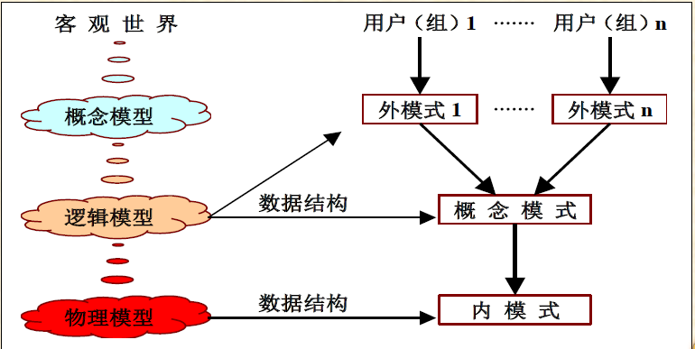
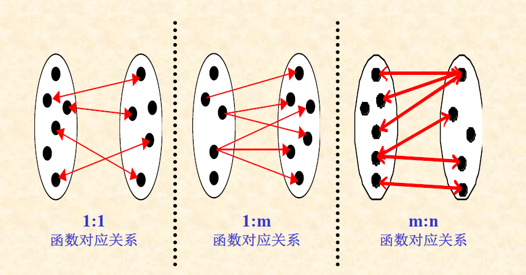
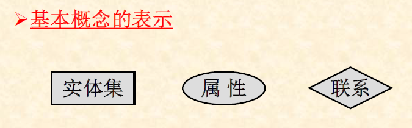
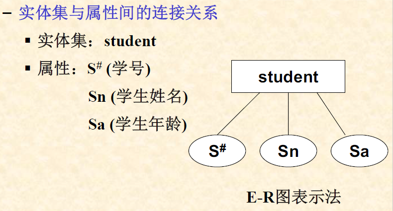
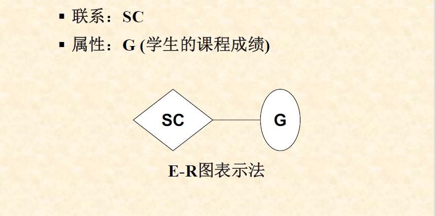
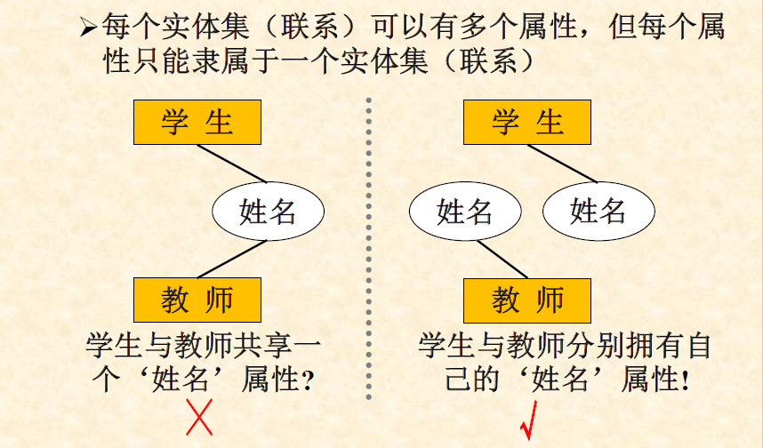
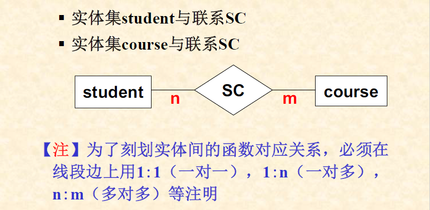
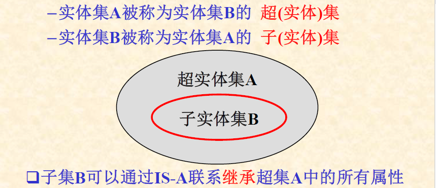
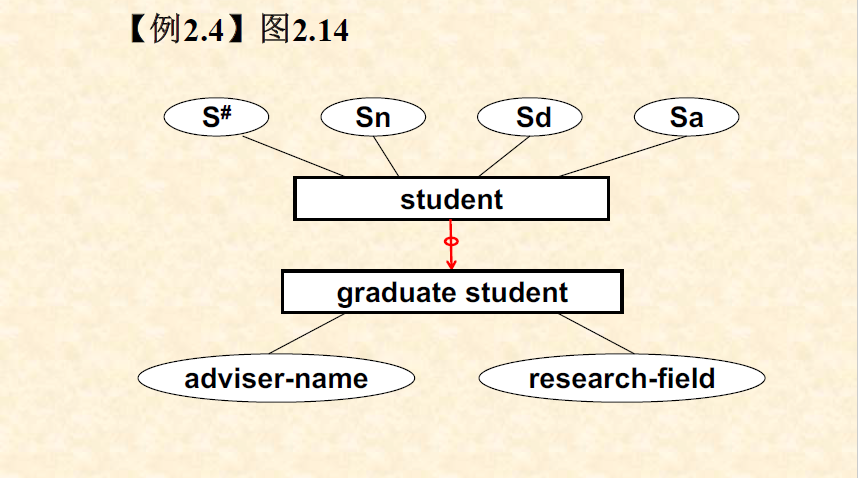

# 第二章 数据模型
## 数据模型的基本概念
+ 数据模型应该能比较真实地模拟现实世界、易于人理解、便于在计算机上实现。
+ 组成  
    + 数据结构
    + 数据操作
    + 数据约束
+ 数据结构是不同类型数据模型的划分依据
---
+ 数据操作：在不同的数据结构上可以提供不同的操作方式与操作类型
---
+ 数据约束，包括：
    + 数据间的语法、语义联系
    + 数据间的制约与依存关系
    + 数据(间)的动态变化规则

## 数据模型的基本概念
+ 概念数据模型(概念模型)
    > 是一种面向客观世界和用户的模型，与具体采用的DBMS及计算机实现无关。并不需要定义实现细节(数据类型，取值约束)。 
    + E-R模型，EE-R模型
    + 面向对象模型
    + 谓词模型
+ 逻辑数据模型(数据模型)
    > 是一种面向数据库系统的模型，概念数据模型只有在转换为逻辑数据模型后才能在数据中得以表示。是一种中介模型。需要DBMS来定义客观事物及其相互关系的实现结构
    + 层次模型，网状模型
    + 关系模型，面向对象模型，谓词模型
    + 对象关系模型
+ 物理数据模型(物理模型)  
向用户提供了一些与物理存储结构和存取方法有关的定义功能
    + 索引的定义
    + 集簇的定义
    + 存储区域的选择
+ 三种数据模型与三级模式之间的关系

## 数据模型的四个世界
+ 现实世界
    > 为整个转换过程提供了客观基础与初始启动环境
    + 用户需求(从而确定了数据库应支持的应用功能和应用范围)
      + 数据需求
      + 处理需求
+ 概念世界
    > 以现实世界为基础作进一步的抽象而形成的概念模型
+ 信息世界
    > 以概念世界为基础，选用特定的DBMS构造而成的逻辑数据模型
    + 侧重于概念数据模型的细化和在数据库系统一级的实现，即利用特定的DBMS所提供的工具来定义逻辑数据模型 
    + 与具体的DBMS有关。
+ 计算机世界
    + 侧重于数据库物理存储结构的描述
      + 存储结构的设计
      + 存取路径的设计
        + 文件结构的选择:堆/直接/索引 文件等
        + 索引/集簇 的设计
      + 存储空间的分配 
    + 是DB的最终实现结构
---

## 概念世界与概念模型

### E-R(实体-联系模型)
  + 实体
      > 客观存在且又能相互区别的事物
      + 实体集(由具有共性的实体所构成的集合)
  + 属性
      > 实体所具有的某种特性或特征
      + 一个实体可以有多个属性
  + 联系
      > 一个实体集中的实体与另一个实体集中的实体之间的对应关系。
      + 联系的种类
          + 两个实体集间的联系(二元联系)
          + 多个实体集间的联系(多元联系)
          + 单个实体集内部的联系
      + 相同实体集之间的多种联系
          > 在同一组实体集之间可以存在多种联系
      + 联系的函数对应关系
          
      + 联系所具有的特性
          > 因联系的发生而产生的特性可以通过联系上的属性来表示
  + 基本概念之间的连接关系
      + 实体集(联系)与属性间的连接关系
      + 实体集与联系间的连接关系
      + 
  + 实体(集)、属性及其连接关系的描述
      + 属性的描述：属性名，属性域
      + 实体的描述：
          + 实体名
          + 实体型：实体名+一组属性名
          + 实体值
          > 一个实体的所有属性的取值构成的集合。在关系模型中，又被称为"元组"
      + 实体集的描述
          + 由具有相同实体型的实体所构成的集合被称为实体集
  + 联系及其与实体集之间的连接关系的描述
      > 由一个'联系名'+'实体集的名称'+'联系上的属性'构成
      + 联系名：每个联系有一个名字
      + 属性
      + 函数对应关系
  + E-R图
      
      + 连接关系的表示
          + 实体集与属性间的连接关系
          
          + 联系与属性的连接关系
          
          + 
          
          + 实体集与联系间的连接关系E-R图
          
+ E-R模型的设计
    + 实体，属性，联系
    + E-R图表示
+ E-R模型的设计选择
    + 实体，属性    
        + 实体：需要进一步多方面的描述信息
        + 属性：单一的描述值
    + 实体，联系
    + 二元联系，三(多)元联系
        + 可以考虑采用若干个二元联系来实现
            + 用户只需要使用他们之间的两两联系
            + 不会出现二义性
    + 联系的函数对应关系
        + 基于系统的语义约束来定义
    + 属性的依附对象
        + 实体(集)中的属性
        > 是该实体的内在特征，不会因为某些联系的出现而产生改变或消亡
        + 联系上的属性
          + 会随着联系的产生而出现，也会随着联系的消亡而消亡

### EE-R模型  
对E-R模型的扩充成分主要是"IS-A联系" 
> 如果实体集B是实体集A的一个子集，且具有比实体集A更多的属性。  

    
+ IS-A联系的表示方法

  
+ 另一种比较有用的扩充充分:弱实体
  > 如果一个实体A的存在需要依赖于其他实体集中的某个实体的存在，那么实体A被称为弱实体  
  > 如：学生，家长(弱实体)，一般为多对一的关系  
P71

### 面向对象模型
  + 基本内容
    + 对象(对象标识符，对象的组成，对象的特点)
    + 类(IS-A, IS-PART-OF)
    + 消息 
  + 对象(客观世界中能够相互区别开的事物)
    + 对象与实体的区别：不仅需要描述对象的属性组成，还可以描述该对象所具有的行为特征；可以且只能通过**对象标识符**来区分不同的对象
    + 对象的组成
        - 对象标识符(OID)(持久化)  
        - 对象的静态特性  
        - 对象的动态特性(可以施加在该对象上的方法)
    + 对象的特点
        - 对象的封装
            * 对象的内部表示
            * 对象的外部表示
            * 优点
        - 对象标识符的独立性
            * 唯一性
            * 持久性
            * 不可重用性
        - 对象属性值的多值性
            * 单值
            * 集合值
            * 对象值
    + 类
        - 可以通过类的定义来描述类中的对象的静态特性和动态特性
        - 实例
        - 元类
    + 类与类之间的关系
        - IS-A关系(继承)
        - IS-PART-OF关系(聚合与分解)
    + 继承
        - 普化(子类到超类的抽象过程) 与 特化(超类到子类的细化过程)
        - 单继承(树状) 与 多继承(格状)
        - 继承的作用
    + 聚合与分解
        - 具有三种语义：组成语义，嵌套语义，联系语义
        - 反映了类中对象之间的组合与分解关系  
    P96
    + 消息
        - 消息的组成：`Type A.Op (O1, O2, ...)`(接受者，操作名，操作参数及其返回结果的类型)
        - 消息和方法的比较:(跨对象，内部)
    + C++与OODB的区别

+ 统一建模语言(UML) 
    + UML类
        - 两个主键联合做关键字
    + UML类的键
    + 关联
      - 每个连接线的末端用一个`m..n`标签形式来表明：这一端至少有m个对象，至多有n个对象与另一端的对象连接(用\*代替n，表示无限；单独的\*表示区间`0..*`)
    + 自关联
        > 一个关联的两端可以连接同一个类。为了区分一个类在自关联中表现的不同角色，分别给这个关联的两端一个名字  
        
        

    + 关联类  
        - 可以用曾在E/R模型中的方法将属性附加到一个关联中
        - 关联类具有自己的名字，但它的属性可认为它依附的关联的属性

        

    + 子类
    + 聚集与组合
        - 聚集：在两个类之间的一条线，线的末端是一个**空的菱形**，含义是一定要为`0..1`
        - 组合:**实心的黑色的菱形**，一定要为`1..1`

        

  
### 谓词模型
主要用于构造知识数据库的"概念数据模型"和"逻辑数据模型"  
+ 实体集
+ 属性:用谓词中的变元表示，属性的域也可用谓词来表示
    > 属性X3为整型:$Int(X_{3})$
    - 用统一的约束谓词$C(x_{i})$来表示变元的约束
+ 联系
    > 谓词中的变元由参与该联系的实体以及联系本身所具有的属性组成
+ 操作
+ 完整性约束
    - 可以用谓词或谓词公式来表示属性间的完整性约束条件
